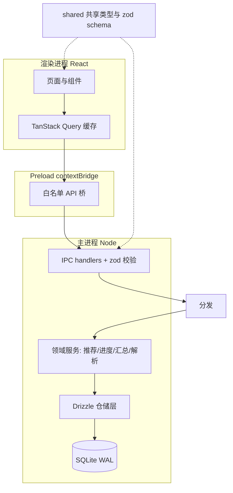

# TaskFlow 架构与技术选型

本文档说明 TaskFlow 桌面应用的技术栈选择、进程分层、目录结构，以及 `better-sqlite3` 原生模块在开发与打包两种环境下的处理方式。

面向读者：实现者本人。目标是让后续每一份文档（数据模型、IPC 契约、UI 规范）都能落在同一套架构约定上。

---

## 1. 技术栈

| 层 | 选型 | 说明 |
| --- | --- | --- |
| 桌面壳 | Electron | 全程 TypeScript，无需 Rust 工具链 |
| 构建 | electron-vite | 主进程 / preload / 渲染进程三套 Vite 配置，秒级 HMR |
| UI | React 19 + TypeScript | 组件化，配合下方状态层 |
| 样式 | Tailwind CSS | 漫画风设计 token 用 Tailwind 主题承载，详见 `ui-spec.md` |
| 数据访问缓存 | TanStack Query | 渲染进程侧的"写后刷新"缓存，替代手写 loading/error 状态 |
| 数据库 | SQLite（`better-sqlite3`） | 同步 API、WAL 模式、单文件、本机零配置 |
| ORM | Drizzle ORM | 类型安全、迁移文件与 schema 同源 |
| 入参校验 | zod | schema 放 `src/shared/`，主进程校验与前端表单复用同一份 |
| 单元测试 | Vitest | 主要覆盖 `src/main/domain/` 的纯函数领域逻辑 |
| 打包 | electron-builder | 处理原生模块 rebuild 与 asar 解包 |

### 1.1 为什么是 Electron 而不是 Tauri

需求方不熟悉 Rust，且明确要求"业务逻辑放后端层"。在 Tauri 里，后端层意味着推荐引擎、项目进度计算、周复盘汇总、Markdown 多行解析全部要用 Rust 实现。Electron 让前后端使用同一门语言（TypeScript），代价仅是安装包体积较大（约 100MB 量级）与内存占用偏高——对一个个人、本机使用的应用而言可以接受。

### 1.2 为什么不需要 HTTP API 文档

桌面应用内前后端通过 Electron IPC 通信，不走 HTTP，因此无需 OpenAPI 文档。等价物是**共享的 TypeScript 类型 + IPC 契约**（见 `ipc-contract.md`）：类型定义放 `src/shared/` 被两端引用，签名对不上编译期即报错，不会像 HTTP 文档那样与实现悄悄脱节。

---

## 2. 进程分层



### 2.1 渲染进程（renderer）

- 只负责展示与交互，**不直接访问数据库、不 import Node 模块**。
- 所有数据读写通过 `window.api.*`（由 preload 暴露）发起。
- TanStack Query 承担缓存与"写后刷新"：任何 mutation 成功后 invalidate 相关 query key，触发重新拉取。对本应用的数据量（单机、百量级行），全量刷新的成本可忽略。

### 2.2 Preload（contextBridge 桥）

- 开启 `contextIsolation`、`sandbox`，关闭 `nodeIntegration`。
- 通过 `contextBridge.exposeInMainWorld('api', ...)` 暴露**白名单**方法，每个方法内部是一次 `ipcRenderer.invoke(channel, payload)`。
- 不把数据库对象、也不把任意 `ipcRenderer` 透传给渲染进程；只暴露契约中定义的具名方法。

### 2.3 主进程（main）

分三层，职责严格分离：

1. **IPC handlers**（`src/main/ipc/`）：每个域一个文件，用 `ipcMain.handle(channel, ...)` 注册。职责是：用 zod 校验入参 -> 调用领域服务或仓储 -> 用统一的 `IpcResult<T>` 包装返回。不写业务逻辑。
2. **领域服务**（`src/main/domain/`）：推荐引擎、进度计算、周复盘汇总、多行解析。**纯函数**，输入输出都是普通对象，不碰数据库也不碰 UI，用 Vitest 直接单测。这是"业务逻辑放后端层"最大的收益。
3. **仓储层**（`src/main/repo/`）：基于 Drizzle 的数据读写，封装 SQL 细节。

数据库连接采用**单例**（`src/main/db/connection.ts`），避免多连接导致的 `database is locked`。

---

## 3. 目录结构

```
task-flow/
├── docs/                      # 设计文档（本目录）
├── prd.md
├── drizzle/                   # Drizzle 生成的迁移文件（append-only，勿改历史）
├── drizzle.config.ts
├── electron.vite.config.ts    # 三套构建配置：main / preload / renderer
├── electron-builder.yml       # 打包配置
├── package.json
├── src/
│   ├── shared/                # 两端共享：类型、zod schema、IPC 频道常量、错误码
│   │   ├── ipc.ts             # IpcResult、频道名、window.api 的类型
│   │   ├── schema/            # zod schema（按域拆分）
│   │   └── types/             # 领域实体类型（Task、Project…）
│   ├── main/
│   │   ├── index.ts           # 主进程入口：建窗、注册 IPC、跑迁移
│   │   ├── db/
│   │   │   ├── connection.ts  # better-sqlite3 单例 + WAL + pragma
│   │   │   ├── schema.ts      # Drizzle 表定义
│   │   │   └── migrate.ts     # 启动时 migrate()
│   │   ├── repo/              # 仓储层
│   │   ├── domain/            # 纯函数领域逻辑（推荐/进度/汇总/解析）
│   │   └── ipc/               # 每个域一个 handler 文件
│   ├── preload/
│   │   └── index.ts           # contextBridge 白名单 API
│   └── renderer/
│       ├── index.html
│       ├── main.tsx
│       ├── app.tsx            # 路由
│       ├── pages/
│       ├── components/
│       ├── features/          # 按域组织的 hooks（封装 window.api + TanStack Query）与该域的组件
│       │   └── task/          # 任务详情抽屉：任务的唯一编辑界面（ui-spec 第 3 节）
│       └── styles/
└── tests/                     # Vitest（领域逻辑为主）
```

---

## 4. 数据库连接与初始化

`src/main/db/connection.ts` 单例，开启对本机应用有意义的 pragma：

```ts
import Database from 'better-sqlite3';
import { app } from 'electron';
import path from 'node:path';

let instance: Database.Database | null = null;

export function getDb(): Database.Database {
  if (instance) return instance;
  const dbPath = path.join(app.getPath('userData'), 'taskflow.db');
  const sqlite = new Database(dbPath);
  sqlite.pragma('journal_mode = WAL');     // 读写并发
  sqlite.pragma('synchronous = NORMAL');   // WAL 下的合理权衡
  sqlite.pragma('foreign_keys = ON');      // 外键约束生效
  sqlite.pragma('busy_timeout = 3000');
  instance = sqlite;
  return sqlite;
}
```

- 数据库文件落在 `app.getPath('userData')`，随系统用户目录，不放进 asar。
- 迁移在主进程启动、建窗之前执行（`src/main/db/migrate.ts`），用 Drizzle 的 `migrate(db, { migrationsFolder: 'drizzle' })`。迁移文件 append-only，永不修改已发布的历史迁移。

---

## 5. 原生模块处理（工程唯一风险点）

`better-sqlite3` 是原生 Node 模块，必须针对 Electron 的 ABI 编译，且在开发与打包两种环境下都能加载。这是全流程唯一需要在 M0 就 spike 验证通过的点。

### 5.1 排除出打包器

在 `electron.vite.config.ts` 中把 `better-sqlite3` 标记为 external，避免 Vite 尝试打包原生 `.node` 二进制：

```ts
export default defineConfig({
  main: {
    build: {
      rollupOptions: { external: ['better-sqlite3'] },
    },
  },
  preload: { /* ... */ },
  renderer: { /* ... */ },
});
```

### 5.2 针对 Electron rebuild

`better-sqlite3` 需要用 `@electron/rebuild` 对 Electron 的 Node 头文件重新编译。加一个脚本，安装后与切换 Electron 版本后执行：

```json
{
  "scripts": {
    "rebuild": "electron-rebuild -f -w better-sqlite3"
  }
}
```

注意：系统 Node 与 Electron 内置 Node 的 ABI 不同。如果要用 `drizzle-kit` 生成迁移（跑在系统 Node 上），与运行 Electron（用内置 Node）之间切换时需要重新 rebuild。生成迁移文件本身不加载原生模块，因此常规 `drizzle-kit generate` 不受影响；只有需要在系统 Node 下直接跑 `better-sqlite3` 时才要 `npm rebuild`。

### 5.3 打包时解包

原生 `.node` 无法从 asar 归档中加载，需在 electron-builder 配置中把它解包：

```yaml
# electron-builder.yml
asarUnpack:
  - "**/node_modules/better-sqlite3/**"
```

同时确保 electron-builder 的 rebuild 覆盖该模块：

```yaml
npmRebuild: true
```

### 5.4 M0 验收

M0 里必须同时验证两条路径都能成功打开数据库并执行一次读写：

1. `npm run dev`（开发环境，Electron 内置 Node）。
2. `npm run dist` 产出的安装包安装后运行（生产环境，asar 解包后的原生模块）。

只有这两条都通过，才算清除了本项目的工程风险。

自检实现为主进程启动时的一次 `app_meta` 读写（`src/main/db/selfCheck.ts`），带 `--selfcheck`
参数时打印结果并按退出码返回，因此两条路径都可自动化验证：

```bash
npm run selfcheck       # 开发路径
npm run selfcheck:dist  # 打包路径（release/mac*/TaskFlow.app）
```

迁移文件不进 asar：electron-builder 的 `extraResources` 把 `drizzle/` 复制到
`resources/drizzle`，运行时由 `src/main/db/migrate.ts` 按 `app.isPackaged` 选择目录。

本机环境两处坑（详见 README）：Cursor 集成终端的 `ELECTRON_RUN_AS_NODE=1` 会让 Electron
以纯 Node 启动，脚本统一经 `scripts/run-electron.mjs` 清理；GitHub Releases 不可达，
Electron 二进制走 `.npmrc` 中的镜像。

---

## 6. 关联文档

- 数据模型与建表 SQL：`data-model.md`
- IPC 接口契约与错误码：`ipc-contract.md`
- 页面路由与视觉规范：`ui-spec.md`
- 里程碑与验收映射：`roadmap.md`
