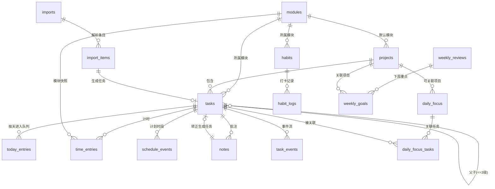

# TaskFlow 数据模型

本文档定义 SQLite 数据模型：三个关键设计决策的推导、ER 图、完整建表 SQL。所有列的语义以本文档为准，Drizzle schema（`src/main/db/schema.ts`）与之一一对应。

时间统一存储为 Unix 毫秒时间戳（整数），日期（如周复盘的周一、习惯打卡日）存 `TEXT` 的 `YYYY-MM-DD`。布尔用 `INTEGER 0/1`。主键统一用 `TEXT`（应用层生成的 UUID/短 id），便于导出恢复时保持引用稳定。

---

## 1. 三个关键设计决策

这三点直接决定了 PRD 第 14 节多条验收标准能否自然成立，是整个模型的骨架。

### 1.1 今日队列按天归属（命中验收标准 1、2）

队列用 `today_entries(date, task_id, sort_order)` 一张表承载：**一个任务在哪天的队列里出现过，就永久留在那天**。`tasks` 上不放 `in_today` 布尔字段。

推导过程值得记下来，因为它推翻了一个更简单的方案。最初的设计是在 `tasks` 上放 `in_today` + `today_sort_order`，任务进队列后一直在里面、跨天什么都不做。它足够简单，但表达不了两件事：

- **当天的成果要留在当天。** 昨天完成的任务、昨天做掉了一半子任务的父任务，回看昨天时都该在。一个布尔字段只有"在/不在队列"两种状态，昨天的画面无从还原——它连"昨天"这个概念都没有。
- **顺延必须是手动的。** 没做完的事不自动跟到第二天（PRD 5.4），要用户点一下"顺延"。而"昨天那行还在昨天、今天也有一行"意味着同一个任务同时归属两天，布尔字段做不到。

于是改成按天存行。代价是多一张表、查队列必须带日期；换来的是每一天的队列画面都能精确还原，以及顺延变成一次"在新的一天插一行"，原来那天的行不动。

**跨天依然什么都不做**：没有定时任务、没有午夜迁移。第二天的队列天然是空的，遗留由 `today.backlog` 查出来给用户看，`today.carryOver` 在用户点击时才插行。验收标准 1「未完成任务跨天后无需重新录入」仍然成立——一次点击不是复制，用户不需要重抄任何文字。

派生规则（领域层，不落库）：

- `Task.inToday` = 今天有没有这个任务的行，供「加入/移出今日队列」这类开关用。
- **行在那天的状态**：完成状态只有一份（`is_done`/`done_at`），但"那天有没有做完"是行级的。`done_at` 落在那天 → 当天达成；`done_at` 晚于那天 → 那天终究没做完；至今未完成 → 待做。
- **后代节点在那天是否露面**：没做完的一直跟着父任务露面；已完成的只在**它完成的那天**露面。于是顺延一个"子任务做了一半"的父任务时，昨天做完的子任务不会跟到今天，今天看到的只剩没做完的分支。

历史追溯（"某任务是哪天进的队列"）由 `today_entries.date` 直接回答，无需再翻 `task_events`。日终处理（推迟到指定日期、放回项目池、放弃等）是插/删 `today_entries` 行 + 记一条事件。

### 1.2 计时记录用区间而非日累计（命中验收标准 6）

`time_entries` 存**区间**：`started_at` / `ended_at`。

- `ended_at IS NULL` 表示正在计时（同一时刻全表最多一条，由领域层保证）。
- 暂停 = 结束当前段；继续 = 开一条新段。跨天、多段天然支持。
- `task_id` 可为空，支持"先无任务计时，结束后再归类"。
- 冗余存一份 `module_id` 快照：记录产生时任务属于哪个模块就固定下来。这样任务日后改了模块，**不会篡改历史周复盘的时间统计口径**。

按天/按周聚合时，跨午夜的区间需要在边界切开，这个切分函数放领域层（`src/main/domain/time.ts`），不进 SQL。任务/项目/模块的累计时间都是对区间求和的派生值，不落库为可变字段（避免与区间数据不一致）。

### 1.3 周复盘按自然周主键 + 确认时冻结快照（命中验收标准 9、10）

`weekly_reviews` 用 `week_start`（该周周一的 `YYYY-MM-DD`）作唯一键，**与实际填写日期无关**。任意日期补写都能归属到正确的自然周，回看历史周也稳定。

自动汇总的数据（各模块完成任务、各模块投入时间、项目进度变化、三件事完成情况、习惯连续记录等）在用户**点击确认时序列化进 `snapshot_json` 冻结**。否则半年后回看这份复盘，会因为项目后来被改动而显示错乱。确认前展示的是实时计算结果；确认后展示的是快照。

---

## 2. 模块枚举

`modules` 预置 8 行，与 PRD 4.1 对应，`id` 用稳定 slug 而非自增，方便导出恢复与代码引用：

`work`（工作）、`hobby`（兴趣）、`growth`（个人提升）、`sport`（运动）、`diet`（饮食）、`expense`（支出）、`social`（人际）、`other`（其他）。

---

## 3. ER 图



---

## 4. 建表 SQL

以下为权威 schema。Drizzle 定义须与之等价；迁移文件由 `drizzle-kit generate` 生成后 append-only。

### 4.1 modules 模块

```sql
CREATE TABLE modules (
  id          TEXT PRIMARY KEY,          -- slug: work/hobby/growth/sport/diet/expense/social/other
  name        TEXT NOT NULL,             -- 显示名（中文）
  color       TEXT NOT NULL,             -- 漫画风配色 token
  sort_order  INTEGER NOT NULL DEFAULT 0
);
```

### 4.2 projects 项目

```sql
CREATE TABLE projects (
  id                 TEXT PRIMARY KEY,
  name               TEXT NOT NULL,
  goal               TEXT,                        -- 项目目标
  default_module_id  TEXT NOT NULL REFERENCES modules(id),
  next_action_task_id TEXT REFERENCES tasks(id),  -- 下一步行动（指向某任务）
  notes              TEXT,                         -- 项目笔记
  status             TEXT NOT NULL DEFAULT 'active', -- active/archived
  sort_order         INTEGER NOT NULL DEFAULT 0,
  created_at         INTEGER NOT NULL,
  updated_at         INTEGER NOT NULL
);
```

累计投入时间、完成进度均为派生值，不落库：进度按 4.3 的叶子任务实时计算，时间对 `time_entries` 求和。

### 4.3 tasks 任务

```sql
CREATE TABLE tasks (
  id                TEXT PRIMARY KEY,
  project_id        TEXT REFERENCES projects(id),   -- 可为空（游离任务/快速记录转任务）
  parent_id         TEXT REFERENCES tasks(id),
  depth             INTEGER NOT NULL DEFAULT 1 CHECK (depth BETWEEN 1 AND 3),
  title             TEXT NOT NULL,
  description       TEXT,                            -- 大纲里 Shift+Enter 写的那段说明，一个任务一份
  module_id         TEXT NOT NULL REFERENCES modules(id), -- 默认继承项目，单任务可改
  is_done           INTEGER NOT NULL DEFAULT 0,
  done_at           INTEGER,                         -- 完成时刻；「哪天完成的」由它派生
  due_date          TEXT,                            -- 可选截止日期 YYYY-MM-DD
  scheduled_at      INTEGER,                         -- 可选日程时间（毫秒）
  sort_order        INTEGER NOT NULL DEFAULT 0,      -- 同级排序
  created_at        INTEGER NOT NULL,
  updated_at        INTEGER NOT NULL
);
CREATE INDEX idx_tasks_project ON tasks(project_id);
CREATE INDEX idx_tasks_parent  ON tasks(parent_id);
```

队列归属不在这张表里，见 4.4。

约束与规则：

- 三级限制由 `depth CHECK` + 应用层在插入时按 `parent.depth + 1` 计算共同保证。
- **进度计算**（验收标准 7）：项目进度 = 已完成叶子任务数 ÷ 全部叶子任务数。叶子 = `tasks` 中不作为任何其他任务 `parent_id` 的行。父级任务、备注、想法、问题、链接均不参与（备注等不在 `tasks` 表，见 4.9）。第一版所有叶子权重相同。
- PRD 4.3 提到"第四层及更深的粘贴内容默认识别为备注"：导入时超过 3 级的行落 `notes`，不落 `tasks`（见第 11 节导入）。
- `description` 是任务本身的说明，只有一份；`notes` 里的批注是可以有很多条、能转成任务的碎片。两者不要混（ui-spec 3.3）。

### 4.4 today_entries 今日队列（按天归属）

```sql
CREATE TABLE today_entries (
  id          TEXT PRIMARY KEY,
  date        TEXT NOT NULL,                -- YYYY-MM-DD，这一行归属哪天的队列
  task_id     TEXT NOT NULL REFERENCES tasks(id) ON DELETE CASCADE,
  sort_order  INTEGER NOT NULL DEFAULT 0,   -- 当天队列内的手动排序
  created_at  INTEGER NOT NULL,
  UNIQUE(date, task_id)
);
CREATE INDEX idx_today_date ON today_entries(date);
CREATE INDEX idx_today_task ON today_entries(task_id);
```

- `UNIQUE(date, task_id)` 让"顺延"天然幂等：重复点不会在同一天留下两行。
- 顺延是 **INSERT 而不是 UPDATE**：新的一天插一行，原来那天的行保持不动。这就是"当天完成的、当天有进展的都留在当日"的实现。
- 一个任务可以有多行（连着几天没做完就每天一行），由此能算出"这件事拖了几天"：取该任务此前最早的 `date`。
- 删任务级联删行；从某一天的队列移出只删那一天的行，别的日期不受影响。

按天归属带来的查询约定：**所有队列相关的读操作都必须带日期**，没有"当前队列"这种无日期的概念（见 `ipc-contract.md` 第 4 节）。

### 4.5 time_entries 计时区间

```sql
CREATE TABLE time_entries (
  id           TEXT PRIMARY KEY,
  task_id      TEXT REFERENCES tasks(id),   -- 可空：无任务计时，结束后再归类
  module_id    TEXT REFERENCES modules(id), -- 模块快照，产生时固定，见 1.2
  started_at   INTEGER NOT NULL,
  ended_at     INTEGER,                      -- NULL = 进行中
  source       TEXT NOT NULL DEFAULT 'timer',-- timer / manual（手动补录）
  note         TEXT,
  created_at   INTEGER NOT NULL
);
CREATE INDEX idx_time_task    ON time_entries(task_id);
CREATE INDEX idx_time_started ON time_entries(started_at);
```

- 允许修改错误记录（验收标准 6）：直接更新 `started_at`/`ended_at`。
- 全表最多一条 `ended_at IS NULL`，由领域层在"开始计时"时先结束正在进行的段来保证。

### 4.6 schedule_events 日程（计划）

```sql
CREATE TABLE schedule_events (
  id          TEXT PRIMARY KEY,
  task_id     TEXT REFERENCES tasks(id),  -- 可空：纯日程占位
  title       TEXT NOT NULL,
  start_at    INTEGER NOT NULL,
  end_at      INTEGER NOT NULL,
  module_id   TEXT REFERENCES modules(id),
  created_at  INTEGER NOT NULL,
  updated_at  INTEGER NOT NULL
);
CREATE INDEX idx_schedule_start ON schedule_events(start_at);
```

时间轴同时渲染"计划"（`schedule_events`）与"实际"（`time_entries`），视觉上区分（见 `ui-spec.md`），二者是不同的表、不同来源。

### 4.7 daily_focus 今日三件事

```sql
CREATE TABLE daily_focus (
  id          TEXT PRIMARY KEY,
  date        TEXT NOT NULL,               -- YYYY-MM-DD
  slot        INTEGER NOT NULL,            -- 1/2/3
  content     TEXT,                        -- 自由输入
  project_id  TEXT REFERENCES projects(id),-- 可选关联项目
  is_done     INTEGER NOT NULL DEFAULT 0,
  created_at  INTEGER NOT NULL,
  updated_at  INTEGER NOT NULL,
  UNIQUE(date, slot)
);

CREATE TABLE daily_focus_tasks (           -- 一件事可关联多个任务
  focus_id  TEXT NOT NULL REFERENCES daily_focus(id) ON DELETE CASCADE,
  task_id   TEXT NOT NULL REFERENCES tasks(id) ON DELETE CASCADE,
  PRIMARY KEY (focus_id, task_id)
);
```

每日三件事由用户每天重新填写，第二天不自动复制（验收标准 3）：新的一天 `date` 变了就是空白，旧记录按 `date` 天然归档，可回看。

### 4.8 habits 习惯 与 habit_logs 打卡

```sql
CREATE TABLE habits (
  id              TEXT PRIMARY KEY,
  name            TEXT NOT NULL,
  module_id       TEXT NOT NULL REFERENCES modules(id),
  repeat_type     TEXT NOT NULL,   -- daily / weekdays / weekly_count
  repeat_weekdays TEXT,            -- weekdays 时: "1,3,5"（周一=1）
  weekly_target   INTEGER,         -- weekly_count 时: 每周 N 次
  is_paused       INTEGER NOT NULL DEFAULT 0,
  created_at      INTEGER NOT NULL,
  updated_at      INTEGER NOT NULL
);

CREATE TABLE habit_logs (
  id          TEXT PRIMARY KEY,
  habit_id    TEXT NOT NULL REFERENCES habits(id) ON DELETE CASCADE,
  date        TEXT NOT NULL,       -- YYYY-MM-DD
  status      TEXT NOT NULL,       -- done / missed / leave（请假） / makeup（补打卡）
  created_at  INTEGER NOT NULL,
  UNIQUE(habit_id, date)
);
CREATE INDEX idx_habitlog_habit ON habit_logs(habit_id);
```

连续次数、历史最长连续、当前连续均为派生值，由领域层从 `habit_logs` 计算（验收标准 8）。习惯不顺延到今日队列。

### 4.9 notes 笔记 / 想法 / 问题 / 链接

```sql
CREATE TABLE notes (
  id                TEXT PRIMARY KEY,
  task_id           TEXT REFERENCES tasks(id) ON DELETE CASCADE, -- 归属任务，可空（游离想法）
  kind              TEXT NOT NULL,   -- note / idea / question / link
  content           TEXT NOT NULL,
  url               TEXT,            -- kind=link 时
  converted_task_id TEXT REFERENCES tasks(id), -- 想法/问题转正生成的任务
  created_at        INTEGER NOT NULL,
  updated_at        INTEGER NOT NULL
);
CREATE INDEX idx_notes_task ON notes(task_id);
```

这些内容不进待办统计、不进进度计算。任一 idea/question 可转成正式任务（记 `converted_task_id`）。

### 4.10 imports 导入 与 import_items 解析条目

```sql
CREATE TABLE imports (
  id          TEXT PRIMARY KEY,
  raw_text    TEXT NOT NULL,       -- 永久保留原始文本（验收标准 12）
  created_at  INTEGER NOT NULL
);

CREATE TABLE import_items (
  id           TEXT PRIMARY KEY,
  import_id    TEXT NOT NULL REFERENCES imports(id) ON DELETE CASCADE,
  line_no      INTEGER NOT NULL,
  parsed_kind  TEXT NOT NULL,      -- task / note / date_header / project_header
  depth        INTEGER,            -- 解析出的层级（>3 归为 note）
  content      TEXT NOT NULL,
  is_done      INTEGER,            -- 解析出的已完成状态
  task_id      TEXT REFERENCES tasks(id), -- 确认导入后生成的任务
  created_at   INTEGER NOT NULL
);
```

原始文本 `raw_text` 永久保留，方便回看（验收标准 12）。解析→预览→用户修正→确认导入的流程见 `ipc-contract.md` 的 `import.*`。

### 4.11 weekly_reviews 周复盘 与 weekly_goals 周重点

```sql
CREATE TABLE weekly_reviews (
  id             TEXT PRIMARY KEY,
  week_start     TEXT NOT NULL UNIQUE,  -- 该周周一 YYYY-MM-DD，见 1.3
  snapshot_json  TEXT,                  -- 确认时冻结的自动汇总快照
  best_result    TEXT,                  -- 手填：本周最满意的成果
  blockers       TEXT,                  -- 手填：遇到的阻碍
  energy         TEXT,                  -- 手填：精力与状态
  lessons        TEXT,                  -- 手填：得到的经验
  next_week_goal TEXT,                  -- 手填：下周希望完成的结果
  confirmed_at   INTEGER,               -- NULL = 未确认（展示实时计算）
  created_at     INTEGER NOT NULL,
  updated_at     INTEGER NOT NULL
);

CREATE TABLE weekly_goals (
  id           TEXT PRIMARY KEY,
  week_start   TEXT NOT NULL,           -- 归属自然周
  content      TEXT NOT NULL,           -- 本周想完成的成果
  project_id   TEXT REFERENCES projects(id),
  sort_order   INTEGER NOT NULL DEFAULT 0,
  created_at   INTEGER NOT NULL
);
CREATE INDEX idx_weeklygoals_week ON weekly_goals(week_start);
```

每周固定周一至周日。`week_start` 是归属键，与填写日期无关，支持切换历史周、补写、修改历史（验收标准 10）。

### 4.12 task_events 事件流

```sql
CREATE TABLE task_events (
  id          TEXT PRIMARY KEY,
  task_id     TEXT NOT NULL REFERENCES tasks(id) ON DELETE CASCADE,
  type        TEXT NOT NULL,   -- created/completed/reopened/moved/added_to_today/removed_from_today
                               -- /postponed/returned_to_pool/split/abandoned
  payload     TEXT,            -- JSON，视事件类型而定（如推迟到的日期）
  created_at  INTEGER NOT NULL
);
CREATE INDEX idx_taskevents_task ON task_events(task_id);
CREATE INDEX idx_taskevents_time ON task_events(created_at);
```

事件流承担历史追溯与周复盘中"未完成并仍在今日队列的任务""任务状态变化"等的数据来源，取代按天快照。

### 4.13 app_meta 元数据

```sql
CREATE TABLE app_meta (
  key    TEXT PRIMARY KEY,
  value  TEXT NOT NULL
);
```

存 schema 版本、导出格式版本、最近备份时间等（用于导出恢复的版本迁移，见 `roadmap.md` M8）。

---

## 5. 派生值一览（不落库，由领域层计算）

| 派生值 | 来源 | 用途 |
| --- | --- | --- |
| `inToday` | 今天在 `today_entries` 有没有行 | 「加入/移出今日队列」开关 |
| 队列行在那天的状态 | `done_at` 与该行 `date` 比较 | 当天达成 / 那天没做完 / 待做 |
| 遗留（backlog） | `today_entries` 中早于今天、任务未完成且今天没有行的 | 首页的一键顺延提示 |
| 项目进度 | `tasks` 叶子完成比例 | 项目列表与详情、周复盘（首页不展示） |
| 任务/项目/模块累计时间 | `time_entries` 区间求和（按午夜切分） | 时间汇总、周复盘 |
| 习惯连续/最长连续 | `habit_logs` 序列 | 习惯卡片、周复盘 |
| Next Task 推荐 | 多表综合（见推荐引擎） | 首页主卡片 |
| 周复盘实时汇总 | 多表按 `week_start` 聚合 | 确认前展示，确认后写入 `snapshot_json` |

把这些设为派生而非可变字段，避免了数据不一致，也让领域逻辑保持为可单测的纯函数。
