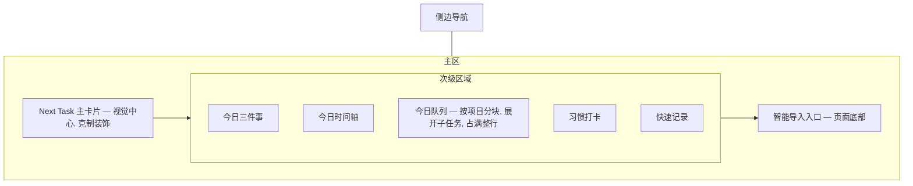

# TaskFlow UI 与视觉规范

本文档定义页面路由、首页区域优先级布局，以及漫画风设计 token 与助手角色气泡规范。视觉方向参考《电器街的漫画店》的配色、漫画表现与热闹氛围，但**不复制官方角色或素材**，助手角色为原创。

设计北极星（PRD 第 2 节）：让用户随时回答"我现在最应该做什么"。因此 Next Task 区域优先级最高、装饰最克制；其余区域可漫画化、热闹。

---

## 1. 页面路由

桌面网页优先，使用客户端路由（React Router，hash 或 memory 模式，配合 Electron 本地加载）。

| 路由 | 页面 | 说明 |
| --- | --- | --- |
| `/` | 首页 Home | Next Task + 次级区域，见第 2 节 |
| `/projects` | 项目列表 | 项目卡片 + 进度 |
| `/projects/:id` | 项目详情 | 三级任务树、笔记、下一步、时间汇总 |
| `/timeline` | 时间轴 | 某日计划 vs 实际，`?date=` 切日期（见 2.4） |
| `/habits` | 习惯 | 打卡、连续、历史 |
| `/review` | 周复盘 | `?week=` 切换历史周、汇总、手填、下周重点（见 2.4） |
| `/import` | 智能导入 | 粘贴 -> 预览 -> 修正 -> 确认；入口也在首页底部 |
| `/settings` | 设置 | 导出/恢复、模块颜色、关于 |

导航：左侧漫画风侧边栏（分镜标签），或顶部工具栏。移动端仅保证基础可访问，不作第一版重点。

**任务详情不占独立路由**：它以抽屉形式叠加在当前页面之上，开合状态由查询参数 `?task=<taskId>` 承载（见第 3 节）。于是在首页点开一个任务不会离开首页，执行流不被打断，同时抽屉仍可用浏览器前进/后退开关、刷新可恢复、链接可复制。

---

## 2. 首页布局（PRD 第 6 节）

严格按优先级自上而下。视觉重心永远是 Next Task。



### 2.1 Next Task 主卡片（PRD 6.1）

页面视觉中心，一次只突出一项任务。展示：

- 任务名称（大字号）
- 所属项目与模块（模块用其配色小标签）
- 与哪项"今日三件事"相关
- 已累计投入时间
- 操作按钮：`开始计时`、`完成`、`换一个`、`查看上下文`

数据来自 `tasks.getNext`。完成后立即请求下一项并动画切换。此卡片保持清晰，避免网点/速度线等装饰干扰执行——装饰只出现在卡片外围或次级区域。

`换一个` 调 `tasks.getNext({ excludeTaskId })`；助手角色气泡展示 `reason.message`（见第 5 节），让推荐可解释但不弹窗、不强制。

`查看上下文` 打开任务详情抽屉（`?task=<taskId>`，见第 3 节）：卡片本身只放执行所需的最少信息，所有细节——子任务、批注、计时分段、截止与日程——都在抽屉里看和改。这样主卡片不必为了「信息完整」而变复杂。

### 2.2 次级区域

按 PRD 6.3 顺序排列，均为分镜式卡片：

1. 今日三件事（`focus.getDay`）：三个槽，可编辑、关联项目/任务、勾选完成；点已关联的任务打开其详情抽屉。每槽是行内输入框，失焦或 Enter 提交 `focus.set`（按 `date + slot` upsert），Esc 撤销本次编辑。左侧的黄色序号圆圈兼作勾选按钮，悬停时序号变 `✓`，达成后文字加粗并划线——保持黑色而不置灰，达成是成果不是废弃。空槽的圆圈禁用（先写下结果才谈达成），清空内容会一并重置完成状态。三件全部达成时在卡片右下角盖一枚 `Mission Clear` 橡皮章（见 6.2）。
2. 今日时间轴（`stats.timeline`）：计划 vs 实际，见第 4 节渲染区分。
3. 今日队列（`today.list`）：首页的主力清单，按项目分块并展开到子任务，见 2.3。
4. 习惯打卡（`habits.list`）：今日状态一键打卡。
5. 快速记录（`notes.quickCapture`）：随手记想法/问题。

回看历史或未来日期时，队列、习惯、快速记录都只会给出「今天」的状态，因此非今日只保留三件事与时间轴。

### 2.3 今日队列（按项目分块 + 展开子任务）

**没有独立的「项目进度」区域**。项目不是首页上另一件要单独关心的事，它就是今天要干的活的归属；把进度条单列出来，用户得在两个区域之间对照才知道「这个项目今天要做什么」。所以项目直接以分块形式进入今日队列：属于同一项目的任务聚成一块，块头写项目名，不属于任何项目的散任务归入最后一类「零散任务」块。想看进度去 `/projects`。

队列展开到**子任务层级**：一件事拆开是什么样，应该在首页就看得见，而不是逐个点开抽屉才知道。因此队列行会连同它的整棵后代树一起渲染。

- **块头**：项目默认模块的色点 + 项目名（链接到 `/projects/:id`）+ 右侧计数 `N 项待做 · 已完成 M`。**块头不放进度条**——进度是项目视角的指标，首页只关心今天。「零散任务」块无色点、无链接。
- **块的顺序**：按块内未完成任务里最靠前的队列序，用户的手动排序仍然说了算；整块做完的沉到最后。散任务块没有固定位置，同样参与排序。
- **哪些行会出现**：`in_today` 且祖先不在队列的任务作为根行；它的**全部后代**跟着展开，哪怕后代自己没加入今日。父子同时入队时只保留父级，避免同一件事出现两次。
- **层级表达**：子行缩进，靠左侧一条竖线连回父行；字号略小、去掉分镜描边，读起来是「父任务内部的清单」而不是并列的队列项。
- **每行的操作**（根行与子行一致）：左侧模块色圆点即勾选按钮，点一下完成（`tasks.complete`），再点一下恢复（`tasks.reopen`）；单击标题打开详情抽屉；鼠标移上去时行尾浮出黑色加粗箭头 `→`，点它设为 Next Task（`tasks.pinNext`）。已完成的行不提供箭头，但保留等宽占位以对齐行尾；箭头槽位常驻占位、仅切换可见性，避免行内文字抖动。
- **完成的任务沉到块末尾而不是消失**：底色转 `--bg-panel-alt`、文字加粗划线但保持黑色（同 6.2 的达成即成果），今天干掉的事一直看得见。只有根行沉底，**子行按 `sort_order` 保持原位**——子任务表达的是任务的结构，顺序一变就不好读了。
- **计数口径**：块头与面板头的计数覆盖块内展示出来的每个节点，含被父任务带出的子任务。它们今天都要动，藏起来只会低估工作量。
- 队列横向占满整行（两列栅格里 `col-span-2`），否则展开后的标题会被挤成两行。
- 拖拽排序与右键日终操作（推迟/放回/放弃/拆分/完成）作用于根行。

### 2.4 智能导入入口

置于页面底部（PRD 11：后续按使用频率再调位置）。点击进入 `/import`。

### 2.5 日期切换与回看

首页默认停在今天，顶栏右侧的日期切换器可以回看任意一天的记录（PRD 14.9：任意日期都能补写和查看）。

- **状态载体**：查询参数 `?date=YYYY-MM-DD`，与任务抽屉的 `?task=` 同一套做法——浏览器前进/后退可切、刷新能恢复、链接可复制。参数缺失或不合法都回落到今天，于是 `/` 永远是今天；切回今天时删掉参数而不是写上今天的日期，避免留下一条明天就指向昨天的链接。
- **控件**：`←` 前一天 / 中间的日期标签 / `→` 后一天 / 偏离今天时才出现的 `回到今天`。日期标签上叠一个透明的原生日期选择器，点一下能跳到任意一天，而显示的仍是中文日期而不是浏览器默认格式；近三天额外挂一个「今天 / 昨天 / 前天 / 明天」的口语标签，一眼知道自己在哪。
- **跟着日期走的区域**：当日三件事（`focus.getDay`，历史日期照样可编辑）、当日时间轴（`stats.timeline`）。换天时三件事的输入行整行重挂，未提交的草稿不会漂到另一天。
- **回看时隐藏的区域**：今日队列、习惯打卡、快速记录，理由见 2.2 末尾。
- **Next Task 主卡片**在回看时整块换成**当日汇总卡片**：助手气泡一句话说清那天投入了多久、几段记录，下面按模块列出时间分布，并常驻 `回到今天` 出口——「现在最该做什么」只对今天成立，回看时留着那张卡片只会误导。汇总由时间轴的 `actual` 在前端算出，不新增 IPC 频道。未来日期只有计划轨有内容，文案相应改成提示「这天还没到」。

时间轴页 `/timeline` 复用同一个控件与同一个 `?date=` 参数，所以首页时间轴卡片的 `展开 →` 会把当前日期一起带过去。周复盘页 `/review` 用同形状的控件切换历史周，参数是 `?week=`，一律规范化到该周周一（PRD 12：复盘归属被复盘的自然周，而不是填写日期）。

日期一律按**本地时区**格式化为 `YYYY-MM-DD`（`src/renderer/lib/date.ts`）。不能用 `toISOString().slice(0, 10)`：那是 UTC 日期，东八区凌晨会算成前一天，「今天」在半夜就错了。

---

## 3. 任务详情抽屉（任务的唯一编辑界面）

PRD 4.3 列出的任务能力——最多三级父子、完成状态、所属项目与模块、今日队列、截止日期、日程时间、多段计时与手动补录、备注/想法/问题/链接——全部在这里查看和编辑。它是全应用**唯一**的任务编辑界面；其余位置只做「勾选完成」「加入今日」这类一键操作，不重复实现表单。

### 3.1 为什么是抽屉而不是独立页面

首页存在的意义是回答「我现在最应该做什么」。若点 `查看上下文` 就整页跳走，用户会丢掉 Next Task 的上下文，还得找路回来，与产品目标相悖。抽屉从右侧滑入、覆盖约 40% 宽度，左侧仍能看见原来的卡片，关掉即回到原位，执行流不断。

代价（无法深链、无法后退）用 `?task=<taskId>` 补掉：抽屉的开合就是一次路由变化，因此浏览器前进/后退可以开关它，刷新能恢复，链接可复制粘贴。

### 3.2 入口

| 来源 | 触发 |
| --- | --- |
| 首页 Next Task 卡片 | `查看上下文` 按钮 |
| 首页今日队列 | 单击任务行（勾选区域除外） |
| 首页今日三件事 | 单击已关联的任务 |
| 项目详情任务树 | 单击任务行 |
| 时间轴 | 单击带 `taskId` 的计划块或实际块 |
| 想法转任务 | `notes.convertToTask` 成功后自动切到新生成的任务 |

### 3.3 分区结构

自上而下，每个分区是一格小分镜。数据来自 `tasks.get`（返回 `TaskDetail`，已含 `notes`、`totalTimeMs`、`linkedFocusSlot`，一次拉齐）。

1. **顶栏**：`完成` / `取消完成` 主按钮、关闭（×）、更多菜单（删除、放弃、移到其他项目）。
2. **身份**：任务标题（大字号，就地编辑）、父任务面包屑、所属项目、模块下拉。一个任务只归属一个主模块（PRD 4.1），所以是单选而非多选。
3. **执行**：`加入/移出今日队列` 开关、`设为 Next Task`、`开始计时`、已累计投入时间。
4. **时间**：截止日期（`dueDate`，可空——第一版不做强制截止管理）、日程时间（`scheduledAt`，填了就出现在时间轴的「计划」轨）。
5. **计时记录**：分段列表（开始、结束、时长、来源），`manual` 段用斜纹网点区别于 `timer` 段，与时间轴同一套视觉语言；支持补录与改错（`timer.addManual` / `timer.update` / `timer.delete`）。
6. **子任务**：直接子级列表，可勾选、可新增。`depth = 3` 时新增入口禁用，助手气泡说明「第三级到底了，再往下的内容会记成备注」（PRD 4.3）。
7. **批注**：`note` / `idea` / `question` / `link` 四类，用手写批注与角色气泡样式呈现，视觉上明确区别于子任务——它们不进待办统计也不进进度计算。`idea` / `question` 带 `转为任务`。
8. **页脚**：关联的今日三件事、创建时间等元信息，弱化处理。

### 3.4 编辑与保存

- **没有保存按钮**。字段级即时提交：文本类在失焦或按 Enter 时调 `tasks.update`，选择类在 change 时调。
- 勾选完成、今日队列开关、子任务勾选走乐观更新；其余用局部加载态（第 7 节通用约定）。
- `tasks.update` 成功后 invalidate `task`、`today`、`nextTask`、`projectTree`、`projects`、`homeSummary`：改模块会影响周复盘的统计口径，改完成状态会影响项目进度与推荐结果。
- 单机单人，第一版不处理编辑冲突。

### 3.5 键盘与无障碍

- `Esc` 关闭；打开时焦点移入抽屉，关闭后归还给触发它的元素。
- 容器 `role="dialog"` + `aria-modal="true"`，`aria-label` 用任务标题。
- 滑入动画遵循 `prefers-reduced-motion`（全局已统一关闭）。
- 点遮罩关闭；抽屉内滚动不穿透背景。

### 3.6 空与异常状态

- `tasks.get` 返回 `NOT_FOUND`（链接里的任务已被删）：抽屉内用助手气泡说明「这件事已经不在了」并给关闭按钮，不抛整页错误。
- 加载中：骨架分镜，不闪烁。
- 无子任务、无批注、无计时记录：各分区显示一行轻量引导文案而**不隐藏分区**——隐藏了用户就不知道这里能加东西。

---

## 4. 时间轴渲染（计划 vs 实际）

同一时间轴上必须视觉区分两类数据（PRD 第 7 节）：

- **计划**（`schedule_events`）：描边/虚线块、半透明、置于轨道背景层。
- **实际**（`time_entries`）：实心漫画分镜块，`source=manual`（手动补录）用斜纹网点区分于 `timer`。
- 正在计时的段用动态速度线/呼吸动画提示"进行中"。
- 跨午夜区间已由领域层按天切分（`stats.timeline` 返回切好的数据），前端直接渲染当天片段。
- 渲染哪一天由 `?date=` 决定（见 2.5），刻度原点跟着那天的 00:00 走，否则回看昨天会把块画到轨道外。未结束的段只可能属于今天，历史日期的未结束段截到当天可见范围末尾。
- 那天既无计划也无计时记录时，图例换成一行说明而不是留着三个对不上任何色块的图例。

---

## 5. 助手角色（原创）与气泡规范

一个全局原创助手角色，贯穿全应用，提供推荐原因与轻量反馈。

- **角色**：原创设定，不复制任何现有作品角色。固定停靠首页 Next Task 卡片附近。
- **气泡内容来源**：
  - 推荐理由：`tasks.getNext` 返回的 `reason.message`（如"你已连续完成 5 项工作任务，要不要换个运动任务喘口气？"对应 `rule: module_balance`）。
  - 完成反馈：任务完成时的漫画式祝贺气泡。
  - 空状态引导：无可执行任务、队列为空时的轻量提示。
  - 励志轮换：静置时每 9 秒换一条可爱励志短句（`useAssistantMessage`），先显示推荐理由再进入轮换；理由变化时重新从理由开始，保证新推荐一定被看到。
- **气泡形状**：尖角朝左，指向左侧的助手角色；角色与气泡垂直居中对齐。
- **约束**：气泡是被动展示，**不弹窗、不打断、不强制**。模块平衡类推荐只建议不逼迫（PRD 6.2）。轮换只换文案，不带声音与位移，`prefers-reduced-motion` 下不做动画。
- **理由到文案的映射**（rule -> 气泡语气基调）：

| reason.rule | 气泡基调示例 |
| --- | --- |
| `active_timer` | "这个还在计时中，继续吧" |
| `focus_linked` | "这关系到你今天想要的成果之一" |
| `in_progress` | "这件已经开了头，收个尾？" |
| `project_next_action` | "这是 XX 项目的下一步" |
| `today_queue_top` | "你把它排在了队列最前面" |
| `module_balance` | "连续工作有一会儿了，换个别的模块？" |

---

## 6. 设计 token（Tailwind 主题承载）

在 `tailwind.config` 的 `theme.extend` 中定义，组件只引用语义 token，不写死色值。

### 6.1 配色

明亮、高饱和但可长时间使用（PRD 13）。

```
--bg-base        纸张米白 / 浅色画布
--bg-panel       分镜卡片底色（略暖白）
--ink            主文字（近黑墨色，非纯黑）
--ink-soft       次要文字
--line           分镜描边（粗黑线）
--accent         主强调（招牌高饱和色，用于 Next Task 焦点、主按钮）
--accent-soft    强调的浅色态
--halftone       网点色（低透明度点阵）
```

模块配色（8 个，来自 `modules.color`，用于标签与时间轴块）：工作/兴趣/个人提升/运动/饮食/支出/人际/其他各一高饱和色，彼此可区分且在浅背景上清晰。

### 6.2 漫画表现元素

- **分镜卡片**：粗黑描边（`--line`）、轻微不规则圆角或直角、可选投影，模拟漫画格。
- **网点（halftone）**：用于卡片背景/强调区域的点阵纹理，低透明度，避免干扰文字。
- **速度线**：用于"进行中计时""换一个"等动作反馈的方向性线条动画。
- **手写批注**：notes（想法/问题/链接）以角色气泡、手写体批注样式呈现，明确区别于待办统计。
- **完成动画**：任务完成时的漫画式反馈（如"达成"拟声词 + 分镜闪现），短促、不阻塞下一步推荐。
- **橡皮章（`.stamp`）**：达成整组目标时盖在卡片上的双线描边斜章，`accent` 色 + `mix-blend-mode: multiply` 与下方文字叠印，落章动画由大砸小回弹。纯装饰（`aria-hidden`）且 `pointer-events: none`，同样的信息必须另有文字承载（如"3 / 3 达成"）。

### 6.3 排版与密度

- 标题用略带漫画感的显示字体，正文用高可读性无衬线体。
- Next Task 区域低密度、大留白、大字号；次级区域可较密、热闹。
- 长时间使用友好：避免纯白刺眼背景、避免过强对比闪烁动画。

### 6.4 无障碍与降级

- 颜色不作为唯一区分手段：模块标签同时带文字/图标；计划 vs 实际除颜色外用描边/网点区分。
- 提供"减少动画"设置项（尊重系统 `prefers-reduced-motion`），完成动画与速度线可关闭。

---

## 7. 状态与交互约定

- 所有数据经 TanStack Query，mutation 成功后 invalidate 相关 query（写后刷新）。
- 乐观更新仅用于高频轻操作（打卡、队列排序、勾选完成）；其余用加载态。
- 错误按 `IpcResult.error.code` 映射为漫画风 toast/气泡，不打断当前任务执行流。
- 空状态（无项目/无任务/队列空/无复盘）均由助手角色给出引导文案，保持热闹不冷场。
